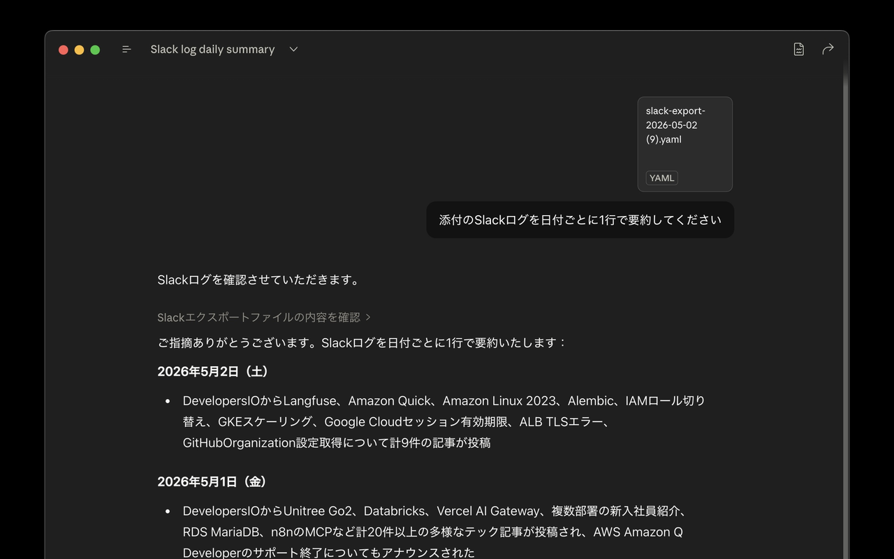
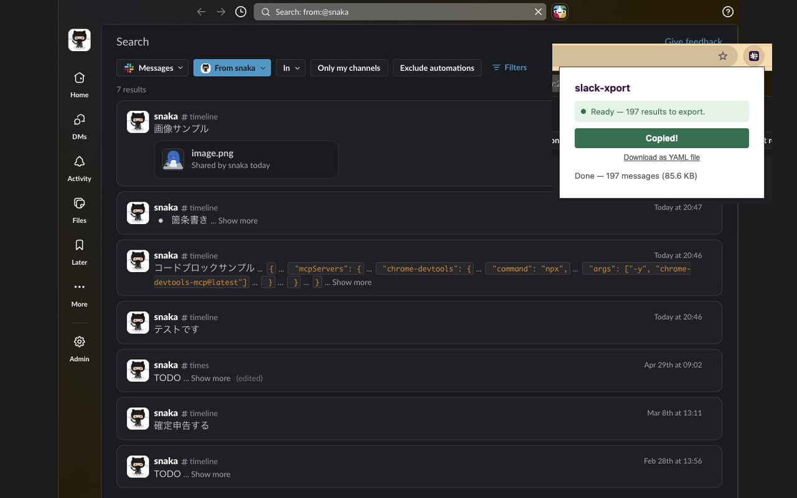

<p align="center">
  
</p>

# slack-xport

> Copy a Slack search result to your clipboard as a single YAML document, ready to paste into an LLM prompt.

<p align="center">
  
</p>

## Why

Pasting Slack threads into ChatGPT, Claude, or any LLM is common — but copying messages by hand loses formatting and breaks across pagination. slack-xport automates the whole flow so you can focus on the prompt instead of the copying.

## Features

- Walks every page of a Slack search automatically
- Expands "Show more" truncations (including those inside quoted blocks)
- Preserves Markdown formatting: bold, italic, code, code blocks, lists, links, images
- Captures file/image attachments as Markdown image syntax
- Copies the result to your clipboard with one click

## Usage

<p align="center">
  
</p>

1. Run a message search at `app.slack.com`
2. Click the slack-xport toolbar icon
3. Click **Export & Copy**

The extension navigates to page 1 if needed, walks every page, expands truncations, and auto-copies the YAML to your clipboard. If the result exceeds 1 MB you are asked to confirm before copying. A "Download as YAML file" link is available as a fallback.

## Output

```yaml
- date: 2024-01-15 Mon 10:30:00
  channel: general
  sender: John Doe
  message: |
    A multi-line message.
    Line breaks, **bold**, `inline code`, and code blocks
    are all preserved.

- date: 2024-01-15 Mon 10:31:00
  channel: random
  sender: Jane Doe
  message: |
    Single-line messages stay readable.
    
```

YAML's `|` block scalar handles multi-line content cleanly. Quotes are omitted when not strictly required, keeping token count low.

## Install (development)

1. Clone this repository
2. Open `chrome://extensions` in Chrome
3. Enable "Developer mode"
4. Click "Load unpacked" and select the project folder

## Privacy

Everything runs locally in your browser. No data is sent to any external server. No analytics, no tracking. The only permissions used are `activeTab` and host permission for `https://app.slack.com/*`.

## Acknowledgements

Built on top of the DOM scraping logic from [xshoji/slack-search-result-exporter](https://github.com/xshoji/slack-search-result-exporter), an MIT-licensed bookmarklet that solves the same problem.

## License

MIT — see [LICENSE](LICENSE).
